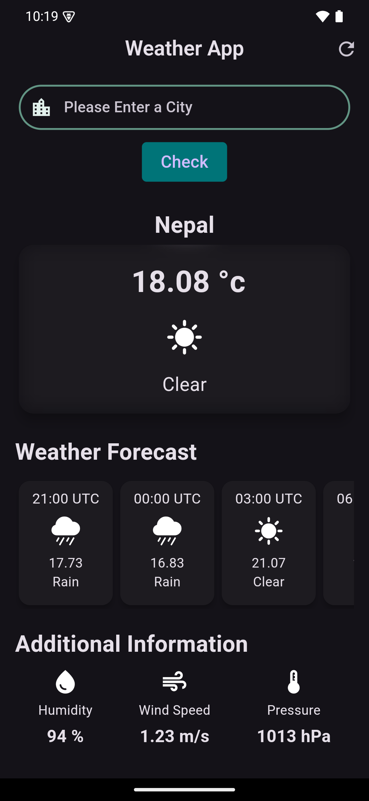

# WeatherApp 🌤️

**WeatherApp** is a simple and clean Android application built using Flutter that provides real-time weather information for your current location or any city worldwide. The app features a modern design, easy-to-use interface, and up-to-date weather details.

## Features
- **Current Weather**: Displays real-time temperature, humidity, and weather conditions.
- **7-Day Forecast**: View the weather forecast for the upcoming week.
- **Search by Location**: Find weather updates for any city worldwide.
- **Location-based Updates**: Get weather data for your current location using device GPS.
- **User-friendly Interface**: A sleek and easy-to-navigate design.

## Screenshots


## Tech Stack
- **Framework**: [Flutter](https://flutter.dev/) - for creating cross-platform mobile apps.
- **API**: [OpenWeatherMap API](https://openweathermap.org/api) - for fetching real-time weather data.

## Getting Started
To run this project locally, follow these steps:

1. **Clone the repository:**
    ```bash
    git clone https://github.com/santoshvandari/WeatherAppAPK.git
    cd WeatherAppApk
    ```

2. **Install dependencies:**
    ```bash
    flutter pub get
    ```

3. **Set up API Key:**
   - Create an account on [OpenWeatherMap](https://home.openweathermap.org/users/sign_up).
   - Get your API key.
   - Open the `lib/constants.dart` file (or wherever you define API constants) and replace `YOUR_API_KEY` with your actual OpenWeatherMap API key:
     ```dart
     const String apiKey = 'YOUR_API_KEY';
     ```

4. **Run the app:**
    ```bash
    flutter run
    ```

## Installation
To install the app on your Android device:
1. Download the latest APK from the [Releases](https://github.com/yourusername/weatherapp/releases) section.
2. Transfer the APK to your phone and install it.

## Contributing
We welcome contributions! Feel free to submit a pull request or open an issue if you find bugs or want to add new features.

## License
This project is licensed under the MIT License. See the [LICENSE](LICENSE) file for details.

## Contact
For any inquiries or support, please reach out at:
- **GitHub**: [@santoshvandari](https://github.com/santoshvandari)

---

Thank you for using WeatherApp! 🌧️🌞 Stay up-to-date with the latest weather conditions anytime, anywhere!
